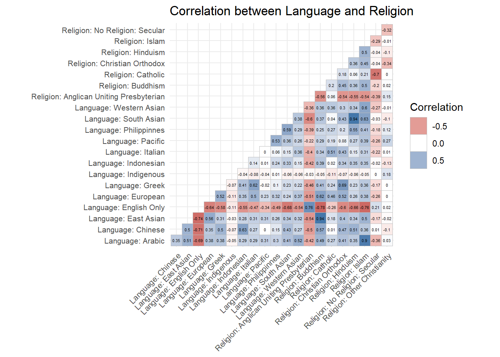
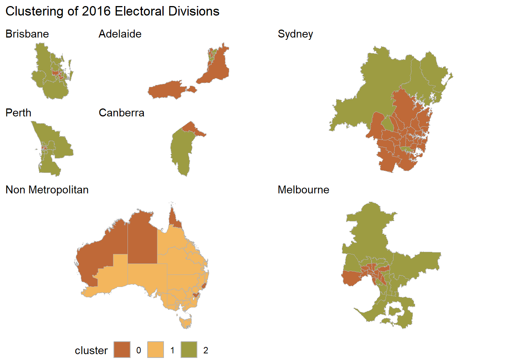

class: split-20
```{r setup, include=FALSE}

options(htmltools.dir.version = FALSE)

library(tidyverse)
library(here)
library(fs)
library(glue)
library(plotly)

# knitr options ####

knitr::opts_chunk$set(
  fig.width=9, fig.height=3.5, fig.retina=3,
  out.width = "100%",
  cache = FALSE,
  echo = FALSE,
  eval = TRUE,
  include=TRUE,
  message = FALSE, 
  warning = FALSE,
  fig.show = TRUE,
  hiline = TRUE
)

# number formatting 
knitr::knit_hooks$set(inline = function(x) { if(!is.numeric(x)){ x }else{ customthemes::digits_formatter(x,sig_digits = 3) } })

#default theming for plots ####

base_theme <- customthemes::custom_plot_theme_md(google_font = "Roboto",background_colour = "white", 
                              legend_pos = "botom",legend_dir = "horizontal") +
              theme(legend.position = "bottom",
                    plot.subtitle = ggtext::element_markdown()
                    ) 

theme_set(base_theme) 

customthemes::set_plot_colours(line_colour ="#0085c7",
                               fill_colour = tinter::lighten("#0085c7",0.5),
                               HVline_colour ="grey90")


xaringanExtra::use_fit_screen()
xaringanExtra::use_tachyons()

```

```{r xaringan-themer, include=FALSE, warning=FALSE}
library(xaringanthemer)

text_font          <- "Open Sans"
header_text_colour <- "#00843D"  #dark green
text_bold_colour   <- tinter::lighten(header_text_colour,0.6)
secondary_colour   <- "#00843D"
title_size <- 15
font_size <- 16
font_size_template <- str_c(font_size,"px")
#  "1rem"

style_duo_accent(
  primary_color = "#000000",#"#1381B0",
  secondary_color = secondary_colour,
  inverse_header_color = "#FFFFFF",
  title_slide_background_color = secondary_colour,
  title_slide_text_color ="#FFFFFF",          #black
  header_color       =    header_text_colour,      
  text_bold_color    = text_bold_colour,
  header_font_google = google_font("Open Sans"),
  text_font_google   = google_font(text_font, "400", "400i", "600i", "700"),
  code_font_google   = google_font("Fira Mono") #,
#  text_font_size = font_size_template
)

sysfonts::font_add_google(text_font, text_font)
showtext::showtext_auto()

```

```{r load data}
project_path <- fs::path(here(),"..")

source(path(project_path,"8. Report","formatting_defaults.R"))

results <- readRDS(path(project_path,"7. Forecast","results.rds"))

```

```{r}
dataset <- read_csv(path(project_path,"4. Data","consolidated.csv"))
clusters <- read_csv(path(project_path,"4. Data","clusters.csv"))         |>
            select(-any_of(c("Metro_Area")))

dataset <- dataset |>
           left_join(clusters,by=c("DivisionNm"="DivisionNm","election_year"="Year"))

rm(clusters)

nationals <- read_csv(path(project_path,"4. Data","cluster_values.csv")) |>
             pivot_longer(-c(Year,cluster),
                          names_to = "Attribute",values_to="National") |>
             mutate(Attribute=str_replace_all(Attribute," - ","_"),
                    Attribute=str_replace_all(Attribute,"-","_"),
                    Attribute=str_squish(Attribute),
                    Attribute=str_replace_all(Attribute," ","_")) 

demographic_data <- dataset |> 
        select(-all_of(party_cols)) |>
        select(-Metro_Area) |>
        select(-Metro,-StateAb,-election_year) |>
         pivot_longer(-c(DivisionNm,Year,cluster),
               names_to = "Attribute",values_to = "CED") |>
         mutate(Year=as.numeric(Year))                   |>
         left_join(nationals,
            by=c("Year","Attribute","cluster")) |>
          select(-cluster) |>
          mutate(Value=CED-National,.keep="unused") |>
          pivot_wider(names_from = Attribute, values_from = Value)

rm(dataset, nationals)

demographic_2021 <- read_csv(path(project_path,"4. Data","cluster_values_2021.csv")) |>
                     select(-Metro_Area, -cluster) |>
                     select(-Metro,-StateAb)

demographic_data <- demographic_data |>
                    filter(Year!=2021) |>
                    bind_rows(demographic_2021)

```

```{r}
enet_folder <- path(project_path,"6. Modelling","elastic_net_eval")
regression <- list()
for(i in 0:2){
    message(glue::glue("cluster_delta_cluster_cluster{i}.rds"))
    regression[[length(regression)+1]] <- readRDS(path(enet_folder,glue::glue("cluster_delta_cluster_cluster{i}.rds")))
}
names(regression) <- str_c("cluster ",0:2)
```

```{r}
#load data

dataset_orig <- read_csv(path(project_path,"4. Data","consolidated_cluster.csv"))      |>
           filter(election_year!=2022)                       |>
           select(-any_of(c("Metro_Area")))              |>
            mutate(across(where(is.numeric), ~ replace_na(.x,0)))

clusters <- read_csv(path(project_path,"4. Data","clusters.csv"))         |>
            select(-any_of(c("Metro_Area")))

dataset <- dataset_orig |>
           left_join(clusters,by=c("DivisionNm"="DivisionNm","election_year"="Year"))

rm(clusters)

vote <- dataset |> select(DivisionNm,Year,election_year,StateAb,Metro,cluster,all_of(party_cols))

cluster_avg <- read_csv(path(project_path,"4. Data","cluster_values.csv")) |>
             filter(Year!=2021) |>
             pivot_longer(-c(Year,cluster),
                          names_to = "Attribute",values_to="National") |>
             mutate(Attribute=str_replace_all(Attribute," - ","_"),
                    Attribute=str_replace_all(Attribute,"-","_"),
                    Attribute=str_squish(Attribute),
                    Attribute=str_replace_all(Attribute," ","_")) 

rest <- dataset |> 
        select(-all_of(party_cols)) |>
        select(-Metro,-StateAb,-election_year) |>
         pivot_longer(-c(DivisionNm,Year,cluster),
               names_to = "Attribute",values_to = "CED") |>
         mutate(Year=as.numeric(Year))                   |>
         left_join(cluster_avg,
            by=c("Year","Attribute","cluster")) |>
          select(-cluster) |>
          mutate(Value=CED-National,.keep="unused") |>
          pivot_wider(names_from = Attribute, values_from = Value)

dataset <- vote |>
           left_join(rest,by=c("DivisionNm","Year")) |>
           mutate(Division=str_c(DivisionNm,"-",election_year),.keep="unused") |>
          select(-any_of(c("Year","Household_Semi_detached"))) |>
          select(-any_of(c("StateAb","Metro")))

variances <- dataset |>
  select(-all_of(c(party_cols,"Division"))) |>
  group_by(cluster) |>
  summarise(across(everything(), ~var(.x)))   |>
  pivot_longer(-cluster,names_to="covariate",values_to="variance")

rm(rest,vote,dataset)

```

```{r}
p_regression <- list()
for(i in 1:3){
   data     <- (regression[[i]]                        |> 
                          filter(RMSE_Overall==min(RMSE_Overall)) |>
                          pull(coefs))[[1]]                       |>
                          pivot_longer(-covariate,names_to="PartyAb",values_to = "coefficient") |>
                          mutate(cluster=names(regression)[i],.before=1) |>
                left_join(variances |> filter(cluster==(i-1)),
                          by=c("covariate")) |>
                mutate(covariate=glue::glue("{covariate} ({round(variance,2)})")) |>
                mutate(covariate=str_remove_all(covariate,"\\(NA\\)")) |>
                mutate(variance = if_else(is.na(variance),0,variance)) |>
                mutate(covariate=forcats::fct_reorder(covariate,variance)) |>
                select(covariate,coefficient,PartyAb)
   
    max_coeff <- max(abs(data$coefficient))
    scale_breaks <- c(0,1,2,round(max_coeff/2,0),ceiling(max_coeff))
    scale_breaks <- c(-scale_breaks,scale_breaks)
    scale_breaks <- unique(scale_breaks)
  
    p_regression[[i]] <-    data |>
                mutate(label=glue("<b>{covariate}</b><br>{PartyAb}: {round(coefficient,3)}")) |>
                ggplot(aes(y=covariate,x=coefficient,colour=PartyAb,text=label)) +
                geom_vline(xintercept = 0) +
                geom_point(size=3.5,shape=18) +
                scale_colour_manual(values=party_palette,name="Party") +
                scale_x_continuous(trans=scales::pseudo_log_trans(), breaks=scale_breaks) +
                labs(
                     x="coefficient",
                     title = glue("Coefficients for {cluster_names[i,]$name_composite}"),
                    subtitle="Covariate's variance in brackets") +
                theme(axis.title.y =element_blank())
                

}

```

.row[.split-15[
.column[.content[ ]]
.column[.content[]]
]]
.row[.content.center[
<br> <br> <br>
# .aussiegreen[Acknowledgement of Country]
]]

---
class: split-20

# Introduction
 
.left-text.f4[

Australia is a parliamentary democracy, with a *Westminster-style* system of government. <br><br>
**The House of Representatives** is made up of one MP for each **Commonwealth Electoral Division**.
<br>
MPs are elected using a **preferential voting system**. Voting is compulsory for all 18+ Australian citizens.
<br>

Historically a *bipartisan system*, recent elections have brought in new political actors, seemingly challenging pre-conceptions about political persuasions.

]

.right-plot[

Photo by <a href="https://unsplash.com/pt-br/@space_launch_system?utm_source=unsplash&utm_medium=referral&utm_content=creditCopyText">Andy Wang</a> on <a href="https://unsplash.com/photos/XplGvY2UrfM?utm_source=unsplash&utm_medium=referral&utm_content=creditCopyText">Unsplash</a>
  
]

---
class: split-20

# Questions

.f3[This project attempts to study how population make-up may influence how Australian citizens may vote for a particular party.]
.f4[
* Are there distinguishable demographic division lines? 

* What are the main demographic factors influencing **primary voting** in federal elections? Do they differ in across electorates?

* Is it possible to use a demographic-based model to understand changes in the 2022 election? Can this model be contrasted against prevalent narratives such as:

 * was the so-called “Teal Wave” supported by discontent moderate Liberal voters? 
 * are Millennials not becoming more conservative as they age? 
 * is culturally diverse voting relevant? 
]

---
class: split-20

# Approach (summarised)
.f3[
1. Obtained data from Census and Election Results (and matched occurrences). 

1. Conducted initial selection of potential demographic covariates. 

1. Clustered similar electorates, then trained a classification model.

1. Trained explainable model (**Primary Voting = f(covariates)**), as analysis tools.

1. *Naively* attempted to forecast the 2022 election, to assess the usefulness of model.
]
---
class: split-20
# Data Selection

.left-44[

* Data extracted through **custom-made packages** ({auscensus}, {auspol} and {aussiemaps}).

* Primary voting data consolidated into **3 groups/parties** of interest (The Coalition, Australian Labor Party, Australian Greens), plus others.

* Demographic covariates inspected and chosen **55 variables from 9 Groups** (*Income, Education Levels, Age, Relationship Status, Household types, Household tenure, Citizenship, Religion, Language*), plus metropolitan/non-metropolitan flag.

* Covariates showing varying degrees of collinearity.

]
.right-54[

```{r eval=FALSE, include=FALSE}
report_images <- path(project_path,'8. Report',
                      '_bookdown_files',
                      'MSc-Project---Carlos-YANEZ-SANTIBANEZ_files','figure-html')
img_folder <- dir_create(path(here(),"img"))
file_copy(path(report_images,"corrlanguagereligion-1.png"),
          path(img_folder,"corrlanguagereligion-1.png"),
          overwrite =TRUE)

file_copy(path(report_images,"clustermap2016-1.png"),
          path(img_folder,"clustermap2016-1.png"),
          overwrite = TRUE)

```


]

---
class: split-20
# Clustering

.left-44[

* Used **HDBSCAN**, which determines the number of clusters.

* Identified 3 clusters, matching narrative of **inner city**, **suburbia** and **regional areas**.

* Used **random forests** for classification of new electorates.

* Key factors in cluster selection :  **metropolitan location**, percentage of **flats**, **Chinese speakers**, **monolingual speakers (English)**, **mortgaged households**.

]
.right-54[

]

---
class: split-20
# Regression Model
.left-44[

* Multivariate regression model -  $Y = \beta X$. $Y$ represents the difference from mean primary voting. $X$ difference against average values.

* Lasso regression to reduce the number of variables for each cluster.

* One elastic net regression for each cluster.

* Distinct clusters, produced distinct results:

  * In inner-city electorates, **religiosity**, **age**, and **income** are the most relevant factors.
  * In suburban electorates, there are similar dynamics, plus **household tenure**.
  * In regional and rural electorates, **higher incomes** tend to prefer **Labor** vote.

]
.right-54[

```{r out.height='500px'}

  ply <- p_regression[[1]] |> 
  interactive_plot() |>
  layout(title = list(x = -20,font=list(size=12)), legend = list(orientation = 'v',font = list(size=10)))

  htmlwidgets::saveWidget(ply,here("img","reg1.html"),libdir = "lib")

```

<embed type="text/html" src="img/reg1.html" height="500" width="580">
]

---
class: split-20

# 2022 Election 

.left-44[

* A naive attempt to retroactively forecast the 2022 election was attempted.

* Forecast using the last Newspoll results prior to the election.

* Modest accuracy was obtained, however, the model proved valuable as an analysis tool.

]
.right-54[

```{r out.height='500px'}
p<-results$prediction_compared |>
  mutate(cluster=as.character(cluster)) |>
  mutate(across(any_of(c("Predicted","Actual")), ~ .x/100)) |>
  mutate(PartyAb=forcats::fct_relevel(PartyAb,party_cols)) |>
  mutate(label = glue("<b>{DivisionNm}</b><br> Predicted: {round(100*Predicted,3)}% <br> Actual: {round(100*Actual,3)}%")) |>
  ggplot(aes(x=Predicted,y=Actual,colour=cluster,text=label)) +
  geom_abline(slope=1,intercept = 0, label="0%",colour="gray50",linetype = 2,hjust=0.8,alpha=0.4) +
  geom_abline(slope=1,intercept = 0.05, label="5%",colour="orange",linetype = 2,hjust=0.8,alpha=0.4) +
  geom_abline(slope=1,intercept = -0.05, label="-5%",colour="orange",linetype = 2,hjust=0.8,alpha=0.4) +
  geom_abline(slope=1,intercept = 0.1, label="10%",colour="red",linetype = 2,hjust=0.8,alpha=0.4) +
  geom_abline(slope=1,intercept = -0.1, label="-10%",colour="red",linetype = 2,hjust=0.8,alpha=0.4) +
  geom_point(alpha=0.7) +
  facet_wrap(vars(PartyAb),ncol=2) +
  scale_colour_manual(values=clusters_colours) +
  scale_x_continuous(labels =  scales::label_percent()) +
  scale_y_continuous(labels =  scales::label_percent()) +
  labs(title="Election Forecast and Results compared")

htmlwidgets::saveWidget(interactive_plot(p),here("img","forecast2022.html"),libdir = "lib")

```

<embed type="text/html" src="img/forecast2022.html" height="500" width="600">

]

---
class: split-20

# 2022 Election - The Teal Wave

.left-44.f4[

* Centrist independents running on a platform of centre-right economics, plus environmental policies (i.e. blue + green).

* Teal candidates successfully unseated moderate Liberal incumbents across several *safe seats*.

* Perceived shift of *dissatisfied Liberal* does not correspond with modelling - Teals were likely elected on Green and Labor vote.

]
.right-54[

```{r out.height='250px'}

selected_demographics <- c("Age: Baby Boomers"="Age_Baby_Boomers",
                           "Age: Geneneration Y"="Age_Gen_Y",
                           "Income: 2,000 or more"="Income_2000_or_more",
                           "Religion: No Religion/Secular"="Religion_No_Religion_Secular")

goldstein <- compare_results("Goldstein",parties=4,results=results)

demo_goldstein <- census_plot(demographic_data,
                                "Goldstein",
                                selected_demographics) + 
                    paletteer::scale_color_paletteer_d("colRoz::uluru") +
                    guides(color=guide_legend(nrow=3, byrow=TRUE))  
 
 
ply <-interactive_plot(goldstein) |> layout(showlegend=FALSE,xaxis=list(title=""),title=list(text="Election Results - Goldstein",x=-8))

htmlwidgets::saveWidget(ply,here("img","goldstein1.html"),libdir = "lib")
```

```{r out.height='250px'}
ply<- interactive_plot(demo_goldstein) |> 
  layout(title=list(text="Selected Demographic Attributes - Goldstein",x=-8),
         legend = list(orientation = 'h'), xaxis = list(title="")) 

htmlwidgets::saveWidget(ply,here("img","goldstein2.html"),libdir = "lib")

```

<embed type="text/html" src="img/goldstein1.html" height="220" width="600"><br>
<embed type="text/html" src="img/goldstein2.html" height="250" width="600">

]

---
class: split-20

# 2022 Election - Green Electorates

.left-44.f4[

* Greens increased their representation from 1 to 4 MPs.

* Greens primary voting higher in inner cities, driven by a combination of higher income, age (Millenials) and irreligiosity.

* In these areas, Green voting has grown alongside the Millennial population.

]
.right-54[

```{r out.height='250px'}

selected_demographics <- c("Age: Baby Boomers"="Age_Baby_Boomers",
                           "Age: Geneneration Y"="Age_Gen_Y",
                           "Income: 2,000 or more"="Income_2000_or_more",
                           "Religion: No Religion/Secular"="Religion_No_Religion_Secular")

goldstein <- compare_results("Wills",parties=4,results=results)

demo_goldstein <- census_plot(demographic_data,
                                "Wills",
                                selected_demographics) + 
                    paletteer::scale_color_paletteer_d("colRoz::uluru") +
                    guides(color=guide_legend(nrow=3, byrow=TRUE))  
 
 
ply <- interactive_plot(goldstein) |> layout(showlegend=FALSE,xaxis=list(title=""),title=list(text="Election Results - Wills",x=-8))
htmlwidgets::saveWidget(ply,here("img","wills1.html"),libdir = "lib")

```

```{r out.height='250px'}
ply<- interactive_plot(demo_goldstein) |>
  layout(title=list(text="Selected Demographic Attributes - Wills",x=-8),
         legend = list(orientation = 'h'), xaxis = list(title="")) 

htmlwidgets::saveWidget(ply,here("img","wills2.html"),libdir = "lib")

```

<embed type="text/html" src="img/wills1.html" height="220" width="600"><br>
<embed type="text/html" src="img/wills2.html" height="250" width="600">

]

---
class: split-20


# 2022 Election - City Fringe

.left-44.f3[

* Outer suburban electorates can be diverse.

* Residential growth and densification can alter results, in addition to generational renewal.

]
.right-54[

```{r out.height='250px'}

selected_demographics <- c("Age: Baby Boomers","Age_Baby_Boomers",
                           "Language: South Asian","Language_South_Asian",
                           "Religion: Islamn","Religion_Islam",
                           "Household: Standalone","Household_Standalone",
                           "Age: Generation Y","Age_Gen_Y",
                           "Language: European","Language_European")

goldstein <- compare_results("Menzies",parties=4,results=results)

demo_goldstein <- census_plot(demographic_data,
                                "Menzies",
                                selected_demographics) + 
                    paletteer::scale_color_paletteer_d("colRoz::uluru") +
                    guides(color=guide_legend(nrow=3, byrow=TRUE))  
 
 
ply <- interactive_plot(goldstein) |> layout(showlegend=FALSE,xaxis=list(title=""),title=list(text="Election Results - Menzies",x=-8))

htmlwidgets::saveWidget(ply,here("img","menzies1.html"),libdir = "lib")

```

```{r out.height='250px'}
ply <- interactive_plot(demo_goldstein) |> 
       layout(title=list(text="Selected Demographic Attributes - Menzies",x=-8),
         legend = list(orientation = 'h'), xaxis = list(title="")) 

htmlwidgets::saveWidget(ply,here("img","menzies2.html"),libdir = "lib")

```

<embed type="text/html" src="img/menzies1.html" height="220" width="600"><br>
<embed type="text/html" src="img/menzies2.html" height="250" width="600">

]

---
class: split-20
# Conclusion

.f3[
* Although not effective in forecasting elections, the model serves its purpose of identifying key factors driving the election.

* Areas to improve include:

  * Refine the segmentation model.
  * Include longitudinal aspect, to account for electorates' history and incumbent.
  * Improve regression model.
]
---
name:thanks
class: inverse center middle

# Thanks
---
name:thanks
class: inverse center middle

# Additional slides

---
# Random forests Importance plot

```{r out.height='500px'}
library(vip)
library(tidymodels)
clustering_folder <-path(project_path,"6. Modelling","clustering_models")

ranger1 <- readRDS(path(clustering_folder,"clustering_ranger.rds"))

p <- extract_workflow(ranger1) |>
  extract_fit_parsnip() |>
  vip(aesthetics=list(fill="#00843D",colour="#00843D")) +
  labs(title="Variable Importance") 

p <- gginnards::delete_layers(p,"GeomCol")
p$data <- p$data |> mutate(label = glue("<b>{Variable}</b>: {round(Importance,4)}"))
p <- gginnards::append_layers(p,geom_col(aes(y=Importance,
                                             x=forcats::fct_reorder(Variable,Importance),
                                             text=label),
                                         fill="#00843D",colour="#00843D"))

ply <- p |> interactive_plot()
htmlwidgets::saveWidget(ply,here("img","vip.html"),libdir = "lib")

```

<embed type="text/html" src="img/vip.html" height="500" width="1000">


---
class: split-20
# Regression Model 
.left-44.f5[

* Multivariate regression model -  $Y = \beta X$. $Y$ represents the difference from mean primary voting. $X$ difference against average values.

* Lasso Regression to reduce the number of variables for each cluster.

* Elastic net fitted, independently for each cluster

* Distinct clusters, produced distinct results:

  * In inner-city electorates, religiosity (or lack of it) and income are the most relevant factors.
  * In suburban electorates, there are similar dynamics, plus household tenure.
  * In regional and rural electorates, higher incomes tend to prefer Labor vote.

]
.right-54[

```{r out.height='500px'}

 ply<- p_regression[[2]] |> 
  interactive_plot() |>
  layout(title = list(x = -20,font=list(size=12)), legend = list(orientation = 'v',font = list(size=10)))

  htmlwidgets::saveWidget(ply,here("img","reg2.html"),libdir = "lib")

```

<embed type="text/html" src="img/reg2.html" height="500" width="600">

]

---
class: split-20
# Regression Model 
.left-44.f5[

* Multivariate regression model -  $Y = \beta X$. $Y$ represents the difference from mean primary voting. $X$ difference against average values.

* Lasso Regression to reduce the number of variables for each cluster.

* Elastic net fitted, independently for each cluster

* Distinct clusters, produced distinct results:

  * In inner-city electorates, religiosity (or lack of) and income are the most relevant factors.
  * In suburban electorates, there are similar dynamics, plus household tenure.
  * In regional and rural electorates, higher incomes tend to prefer Labor vote.

]
.right-54[

```{r out.height='500px'}

 ply<- p_regression[[3]] |> 
  interactive_plot() |>
  layout(title = list(x = -20,font=list(size=12)), legend = list(orientation = 'v',font = list(size=10)))

  htmlwidgets::saveWidget(ply,here("img","reg3.html"),libdir = "lib")

```

<embed type="text/html" src="img/reg3.html" height="500" width="600">

]

---
class: split-20
# 2022 Election - Teal Wave

.left-44.f4[

* 2022 election saw centrist independents, running on a platform of centre-right economics, but green-focused policies (blue + green).

* Teal candidates successfully unseated moderate Liberal incumbents across several *safe seats*.

* Perceived shift of *dissatisfied Liberal* does not correspond with modelling - Teals were likely elected on Green and Labor vote.

]
.right-54[

```{r out.height='250px'}

selected_demographics <- c("Age: Baby Boomers"="Age_Baby_Boomers",
                           "Age: Geneneration Y"="Age_Gen_Y",
                           "Income: 2,000 or more"="Income_2000_or_more",
                           "Religion: No Religion/Secular"="Religion_No_Religion_Secular")

goldstein <- compare_results("Wentworth",parties=4,results=results)

demo_goldstein <- census_plot(demographic_data,
                                "Wentworth",
                                selected_demographics) + 
                    paletteer::scale_color_paletteer_d("colRoz::uluru") +
                    guides(color=guide_legend(nrow=3, byrow=TRUE))  
 
 
ply <- interactive_plot(goldstein) |> layout(showlegend=FALSE,xaxis=list(title=""),title=list(text="Election Results - Wentworth",x=-8))
htmlwidgets::saveWidget(ply,here("img","wentworth1.html"),libdir = "lib")

```

```{r out.height='250px'}
ply <- interactive_plot(demo_goldstein) |> 
  layout(title=list(text="Selected Demographic Attributes - Wentworth",x=-8),
         legend = list(orientation = 'h'), xaxis = list(title="")) 

htmlwidgets::saveWidget(ply,here("img","wentworth2.html"),libdir = "lib")

```

<embed type="text/html" src="img/wentworth1.html" height="220" width="600"><br>
<embed type="text/html" src="img/wentworth2.html" height="250" width="600">

]


---
class: split-20
# 2022 Election - Green Electorates

.left-44.f4[

* In the 2022 election, Greens increased the number of MPs from 1 to 4.

* Greens primary voting higher in inner cities, driven by a combination of higher income, age (Millenials) and irreligiosity.

* In these areas, Green voting has grown alongside the Millennial population.

]
.right-54[

```{r out.height='250px'}

selected_demographics <- c("Age: Baby Boomers"="Age_Baby_Boomers",
                           "Age: Geneneration Y"="Age_Gen_Y",
                           "Income: 2,000 or more"="Income_2000_or_more",
                           "Religion: No Religion/Secular"="Religion_No_Religion_Secular")

goldstein <- compare_results("Ryan",parties=4,results=results)

demo_goldstein <- census_plot(demographic_data,
                                "Ryan",
                                selected_demographics) + 
                    paletteer::scale_color_paletteer_d("colRoz::uluru") +
                    guides(color=guide_legend(nrow=3, byrow=TRUE))  
 
 
ply<- interactive_plot(goldstein) |> layout(showlegend=FALSE,xaxis=list(title=""),title=list(text="Election Results - Ryan",x=-8))
htmlwidgets::saveWidget(ply,here("img","ryan1.html"),libdir = "lib")

```

```{r out.height='250px'}
ply <- interactive_plot(demo_goldstein) |>
  layout(title=list(text="Selected Demographic Attributes - Ryan",x=-8),
         legend = list(orientation = 'h'), xaxis = list(title="")) 

htmlwidgets::saveWidget(ply,here("img","ryan2.html"),libdir = "lib")

```

<embed type="text/html" src="img/ryan1.html" height="220" width="600"><br>
<embed type="text/html" src="img/ryan2.html" height="250" width="600">
]


---
class: split-20
# 2022 Election - Newcastle

.left-44.f3[

* The model does not reflect primary voting in Newcastle.

]
.right-54[

```{r out.height='250px'}

selected_demographics <- c("Religion: Secular","Religion_No_Religion_Secular",
                           "Relationship: Married","Relationship_Married",
                           "Australian Citizens","Australian_Citizens",
                           "Education: Not Stated","Education_Not_Stated"
                       )

goldstein <- compare_results("Newcastle",parties=4,results=results)

demo_goldstein <- census_plot(demographic_data,
                                "Newcastle",
                                selected_demographics) + 
                    paletteer::scale_color_paletteer_d("colRoz::uluru") +
                    guides(color=guide_legend(nrow=3, byrow=TRUE))  
 
 
ply <- interactive_plot(goldstein) |> 
  layout(showlegend=FALSE,xaxis=list(title=""),title=list(text="Election Results - Newcastle",x=-8))

htmlwidgets::saveWidget(ply,here("img","newcastle1.html"),libdir = "lib")

```

```{r out.height='250px'}
 ply <- interactive_plot(demo_goldstein) |> 
  layout(title=list(text="Selected Demographic Attributes - Newcastle",x=-8),
         legend = list(orientation = 'h'),
         xaxis = list(title="")) 
  
htmlwidgets::saveWidget(ply,here("img","newcastle2.html"),libdir = "lib")

```

<embed type="text/html" src="img/newcastle1.html" height="220" width="600"><br>
<embed type="text/html" src="img/newcastle2.html" height="250" width="600">

]
